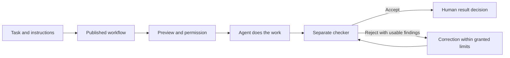

# December Command


[English](README.md) · [Русский](README.ru.md) · [Start here](docs/index.md) · [Architecture](docs/architecture.md) · [Contribute](CONTRIBUTING.md)

[](https://github.com/VasilyKolbenev/agent-conductor/actions/workflows/ci.yml)
[](LICENSE)

**Give your coding agents a shared workflow, a separate checker, and clear points for your decisions.**

December Command runs locally and brings your AI coding tools into one Studio.
Create a task, choose a workflow, review what may run, and follow the work through execution and checking.
You can confirm each action or authorize a bounded sequence with a limit on its work.
Human decision steps still wait for you.

**December Command v0.1.0 alpha.** The V1 candidate is under acceptance; this is not a completed release announcement.
The Python package is `agent-conductor`, and its command is `conduct`.
See the [candidate's evidence and remaining checks](docs/release-notes-v1-alpha.md).

## Choose your first step

| You want to… | Start with… |
| --- | --- |
| See the interface without connecting a paid account | The demo below |
| Connect your coding tools and try a real task | [First run](docs/first-run-v1.en.md) |
| Understand what happens after you click Run | [Architecture, with a diagram](docs/architecture.md) |
| Make your first change, with or without an AI assistant | [Contributor guide](CONTRIBUTING.md) |

## Try the demo

You need **Git and Python 3.11+**. A virtual environment keeps this project's packages separate from other Python projects.
These commands install a source checkout for exploration. Use the [first-run guide](docs/first-run-v1.en.md)
and the identified build for release-candidate acceptance; the default branch alone does not identify that build.

<details open>
<summary><strong>Windows · PowerShell</strong></summary>

```powershell
git clone https://github.com/VasilyKolbenev/agent-conductor.git
cd agent-conductor
py -3 -m venv .venv
.\.venv\Scripts\python.exe -m pip install -e .
.\.venv\Scripts\conduct.exe demo
```

</details>

<details>
<summary><strong>macOS / Linux · terminal</strong></summary>

```sh
git clone https://github.com/VasilyKolbenev/agent-conductor.git
cd agent-conductor
python3 -m venv .venv
.venv/bin/python -m pip install -e .
.venv/bin/conduct demo
```

</details>

Open the address printed in the terminal, normally `http://127.0.0.1:7777/`.
You should see Studio with a sample workflow and run. Try **Runs**, **Decisions**,
the **Trace / Orbit** views, and the language and theme switches. Stop the server with **Ctrl+C**.
If the port is busy, add `--port 8080` to the demo command.

The demo uses a temporary copy of sample data. It needs no provider login and starts no paid model task.
A successful demo shows the interface; it does not prove that your real harness accounts are configured.

## From a task to a checked result



The workflow decides the actual steps and return paths. The diagram shows the core idea, not every possible workflow.
A process finishing successfully is not the same as its work being verified.
An uncertain result stays visible and requires resolution.

Studio has five screens: **Overview, Workflow, Runs, Decisions, and Agents**.
It includes Russian and English, light and dark themes, task-bound runs, and quota/balance readings with their source and age.

## Bring your existing tools

A **harness** is the coding application that runs the model and its tools.
December Command coordinates these applications; you keep their accounts and payment methods.

| V1 harness | Account route | Resource reading |
| --- | --- | --- |
| Claude Code | Native subscription login | Subscription windows and reset times |
| Codex | Native subscription login | Subscription windows and reset times |
| Kimi Code | Native subscription login | Native usage source |
| Grok Build | Native subscription login | Native quota source |
| DeepSeek Harness | Direct DeepSeek API key | Money balance and currency; reset does not apply |

These are the V1 integration targets, not a claim that all five have passed live acceptance.
Use the [pinned versions and setup instructions](docs/first-run-v1.en.md), then check the
[release notes](docs/release-notes-v1-alpha.md) for what has actually been verified.
DeepSeek API credits are purchased from DeepSeek; Studio uses the configured key and displays the reported balance.

## Built to be understandable

- **Local application:** Python 3.11+, no runtime Python dependencies; the interface is plain HTML, CSS, and JavaScript.
- **Visible authority:** inspect the task and limits before authorizing work; pause and revoke are explicit controls.
- **Readable history:** workflow revisions, decisions, and results are recorded on disk.
- **A separate check:** the checker evaluates the result, rather than treating the agent's own success message as proof.

New to the code? Start with the [repository map and glossary](docs/architecture.md).
For the agreed V1 boundary and future memory/learning work, see the [V1 / V2 roadmap](docs/v1-v2-scope.md).

<details>
<summary><strong>CLI reference · useful once you leave the demo</strong></summary>

Run `conduct --help`, or add `--help` to a command, for its flags.
Use the executable inside your virtual environment if it is not activated.

| Command | Purpose |
| --- | --- |
| `conduct demo` | Open the bundled sample in a temporary directory. |
| `conduct init` | Create project data; interactive terminals ask setup questions. |
| `conduct validate` | Check the map and lane files. |
| `conduct doctor` | Explain readiness problems and the next action. |
| `conduct providers` | Configure executable paths and allowed environment-variable names. |
| `conduct ownership` | Activate, inspect, or explicitly recover project ownership. |
| `conduct up` | Start local Studio for the project. |
| `conduct prompt` | Print working instructions for an agent's reporting role. |
| `conduct report` | Print the merged lane state as Markdown. |
| `conduct preview` | Prepare a synthetic dispatch preview without executing it. |
| `conduct integration-smoke` | Exercise the synthetic execution road; not a live provider task. |
| `conduct reconcile` | Inspect actions left uncertain after interruption. |

Project-map templates are different from Studio's workflow starters:

- **`--template NAME`** skips the `conduct init` questions and chooses a project map:
  - `default-orbit` — the default five-stage map.
  - `single-harness` — one implementing role and a human decision, without a reviewer.
  - `empty` — a minimal placeholder map.
  - `minimal` — the protocol's example map.

The bootstrap prompt follows the map: where nodes are placeholders, it tells the agent to replace them with your real components;
where nodes already name components, it tells the agent to check each one against your project instead.
`conduct init` does not overwrite existing project data. Follow [first run](docs/first-run-v1.en.md) for ownership activation.

</details>

## Join in

Small fixes, clearer explanations, and reproducible bug reports all help.
[CONTRIBUTING](CONTRIBUTING.md) explains local setup, choosing a focused check, and a first pull request.
[Browse the documentation](docs/index.md) for tutorials, architecture, reference material, and release procedures.
In a local checkout, the documentation entry point is `docs/index.md`.

Released under the [MIT license](LICENSE).
