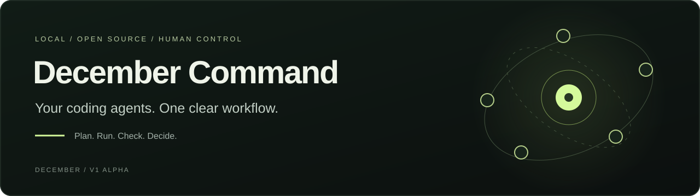
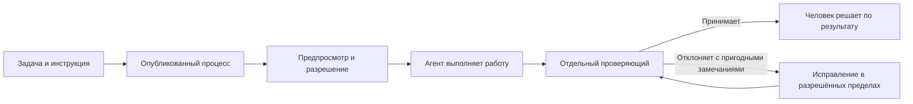

# December Command



[English](README.md) · [Русский](README.ru.md) · [С чего начать](docs/index.ru.md) · [Архитектура](docs/architecture.ru.md) · [Внести вклад](CONTRIBUTING.ru.md)

[](https://github.com/VasilyKolbenev/agent-conductor/actions/workflows/ci.yml)
[](LICENSE)

**Общий процесс для coding-агентов, отдельная проверка результата и понятные точки для ваших решений.**

December Command работает локально и объединяет ваши ИИ-инструменты разработки в Studio.
Создайте задачу, выберите процесс, проверьте разрешённые действия и следите за исполнением и проверкой.
Можно подтверждать каждое действие или разрешить ограниченную последовательность шагов.
Шаги с решением человека по-прежнему ждут вас.

**December Command v0.1.0 alpha.** Кандидат V1 проходит приёмку; это ещё не объявление о завершённом выпуске.
Пакет Python называется `agent-conductor`, команда — `conduct`.
[Что уже проверено и что осталось](docs/release-notes-v1-alpha.ru.md).

## Выберите первый шаг

| Что вы хотите | Куда перейти |
| --- | --- |
| Посмотреть интерфейс без подключения платного аккаунта | Демо ниже |
| Подключить свои инструменты и попробовать настоящую задачу | [Первый запуск](docs/first-run-v1.md) |
| Понять, что происходит после нажатия «Запустить» | [Архитектура со схемой](docs/architecture.ru.md) |
| Сделать первое изменение самостоятельно или с ИИ | [Руководство участника](CONTRIBUTING.ru.md) |

## Попробуйте демо

Понадобятся **Git и Python 3.11+**. Виртуальное окружение хранит пакеты этого проекта отдельно от других проектов Python.
Команды ниже устанавливают исходный код для знакомства. Для приёмки конкретного кандидата используйте
его сборку и [инструкцию первого запуска](docs/first-run-v1.md): основная ветка сама по себе не определяет проверенную сборку.

<details open>
<summary><strong>Windows · PowerShell</strong></summary>

```powershell
git clone https://github.com/VasilyKolbenev/agent-conductor.git
cd agent-conductor
py -3 -m venv .venv
.\.venv\Scripts\python.exe -m pip install -e .
.\.venv\Scripts\conduct.exe demo
```

</details>

<details>
<summary><strong>macOS / Linux · терминал</strong></summary>

```sh
git clone https://github.com/VasilyKolbenev/agent-conductor.git
cd agent-conductor
python3 -m venv .venv
.venv/bin/python -m pip install -e .
.venv/bin/conduct demo
```

</details>

Откройте адрес из терминала, обычно `http://127.0.0.1:7777/`.
Вы увидите Studio с примером процесса и запуска. Посмотрите экраны **Запуски** и **Решения**,
представления **Трасса / Орбита**, переключатели языка и темы. Завершить сервер — **Ctrl+C**.
Если порт занят, добавьте `--port 8080` к команде демо.

Демо использует временную копию примера, не требует входа к провайдерам и не запускает платную модельную задачу.
Работающее демо показывает интерфейс; оно ещё не доказывает, что реальные аккаунты подключены.

## От задачи до проверенного результата



Конкретные шаги и возвраты определяет выбранный процесс. На схеме показана основная идея, а не все возможные процессы.
Успешное завершение программы само по себе не означает, что работа проверена.
Неопределённый результат остаётся видимым и требует решения.

В Studio пять экранов: **Обзор, Процесс, Запуски, Решения и Участники**.
Есть русский и английский языки, светлая и тёмная темы, запуски с привязкой к задачам,
показания квот и баланса с источником и временем наблюдения.

## Подключите привычные инструменты

**Harness** — приложение, которое запускает модель и её инструменты для работы с кодом.
December Command управляет этими приложениями; аккаунты и способ оплаты остаются у их провайдеров.

| Harness в V1 | Способ подключения | Показания ресурсов |
| --- | --- | --- |
| Claude Code | Штатный вход по подписке | Окна подписки и время сброса |
| Codex | Штатный вход по подписке | Окна подписки и время сброса |
| Kimi Code | Штатный вход по подписке | Штатный источник использования |
| Grok Build | Штатный вход по подписке | Штатный источник квот |
| DeepSeek Harness | Прямой ключ DeepSeek API | Денежный баланс и валюта; сброс не применяется |

Это состав интеграций V1, а не утверждение, что все пять уже прошли живую приёмку.
Используйте [закреплённые версии и настройку](docs/first-run-v1.md), затем посмотрите
[заметки к кандидату](docs/release-notes-v1-alpha.ru.md), где отделены реализация и фактические проверки.
Баланс DeepSeek API пополняется у DeepSeek; Studio использует настроенный ключ и показывает полученный баланс.

## В устройстве можно разобраться

- **Локальное приложение:** Python 3.11+, без зависимостей Python для обычной работы; интерфейс на HTML, CSS и JavaScript.
- **Понятные разрешения:** задача и пределы видны до запуска; пауза и отзыв разрешения — явные действия.
- **История на диске:** сохраняются версии процесса, решения и результаты.
- **Отдельная проверка:** результат оценивает проверяющий; сообщения исполнителя «всё готово» недостаточно.

Новичкам в коде поможет [карта репозитория и словарь](docs/architecture.ru.md).
Границы V1 и будущая работа с памятью и улучшениями описаны в [роадмапе V1 / V2](docs/v1-v2-scope.md).

<details>
<summary><strong>Команды · пригодятся после демо</strong></summary>

Список параметров показывает `conduct --help` или `--help` у нужной команды.
Если окружение не активировано, используйте полный путь к команде внутри `.venv`.

| Команда | Назначение |
| --- | --- |
| `conduct demo` | Открыть пример во временной папке. |
| `conduct init` | Создать данные проекта; в интерактивном терминале задать вопросы настройки. |
| `conduct validate` | Проверить карту и файлы отчётности агентов. |
| `conduct doctor` | Объяснить, что мешает работе и что сделать дальше. |
| `conduct providers` | Настроить пути к инструментам и разрешённые имена переменных окружения. |
| `conduct ownership` | Активировать, проверить или явно восстановить владение проектом. |
| `conduct up` | Запустить локальный Studio для проекта. |
| `conduct prompt` | Напечатать инструкцию для отчётности агента в выбранной роли. |
| `conduct report` | Напечатать объединённые отчёты агентов в Markdown. |
| `conduct preview` | Подготовить синтетический предпросмотр без исполнения. |
| `conduct integration-smoke` | Пройти синтетическую проверку исполнения, без настоящей задачи провайдера. |
| `conduct reconcile` | Найти действия с неопределённым исходом после прерывания. |

Шаблоны карты проекта отличаются от стартовых процессов Studio:

- **`--template NAME`** пропускает вопросы `conduct init` и выбирает карту:
  - `default-orbit` — стандартная карта из пяти стадий.
  - `single-harness` — роль исполнителя и решение человека, без проверяющего.
  - `empty` — минимальная карта с заготовкой узла.
  - `minimal` — пример карты из протокола.

Начальная инструкция предлагает заменить узлы-заготовки реальными компонентами проекта;
если компоненты уже заданы, предлагает проверить их соответствие проекту.
`conduct init` не перезаписывает существующие данные. Активация владения описана в [первом запуске](docs/first-run-v1.md).

</details>

## Присоединяйтесь

Небольшие исправления, понятные объяснения и воспроизводимые сообщения об ошибках тоже полезны.
В [CONTRIBUTING](CONTRIBUTING.ru.md) описаны настройка окружения, выбор нужной проверки и первый pull request.
[Навигатор документации](docs/index.ru.md) ведёт к инструкциям, архитектуре, справочникам и процедурам выпуска.
В локальной копии репозитория документация начинается с `docs/index.ru.md`.

Лицензия — [MIT](LICENSE).
