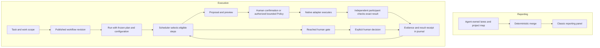

# December Command architecture

[Русская версия](architecture.ru.md) · [First run](first-run-v1.en.md) · [Contributing](../CONTRIBUTING.md)

December Command runs locally on Python 3.11+ with no runtime dependencies. Its browser UI is plain JavaScript, HTML and CSS, served without a build step. Studio opens at `/` and has five screens: Overview, Workflow, Runs, Decisions and Agents. The classic reporting panel remains at `/panel/index.html`.

The Python server owns validation, storage and execution authorization. The browser presents those facts and sends explicit requests; rendering a button or opening a page does not authorize model work. Execution goes through configured native harness adapters for Claude Code, Codex, Kimi Code, Grok Build and DSH. Each needs its own supported configuration and access; being listed is not proof that it is ready on this machine.

## Two connected views, two different sources of truth

**Reporting lanes** describe what agents say is happening. Each agent writes its own JSON lane. A deterministic merge combines the lanes with the project map to calculate disagreements, stale reports and questions for the human. Lanes do not authorize execution and are not the journal of a Studio run. Their format is defined in [Protocol v1](../spec/PROTOCOL.md).

**Execution workflows** describe permitted work. Studio publishes a workflow revision and opens a run from it. The run's plan and configuration stay fixed; proposals, authorizations, decisions, evidence and results are appended to its journal. Current state is calculated from that history. A newer workflow revision does not silently change an existing run.

The scheduler calculates eligibility; it does not itself start processes. The Policy driver may advance eligible steps only while its reviewed authorization is active.

## Follow one task

1. **Create a task.** It has an identity, title and permanent `work_scope`. Several runs can belong to the same task; their task binding is part of each run's frozen configuration.
2. **Publish the workflow and open a run.** A draft can change. Publishing creates a new immutable revision. Opening a run freezes the selected plan, participant bindings and configuration; it does not start a harness.
3. **Propose and inspect.** A proposal names the step, participant, capability, inputs, scope and limits. Its preview has a content digest: a fingerprint used to detect changed terms. A proposal creates no execution authority.
4. **Authorize.** Confirm mode needs a fresh human confirmation of one unchanged preview. An explicitly opted-in bounded Policy run needs a separate preview and human authorization of its plan, inputs, participants and budgets.
5. **Execute and check.** The runtime records authorization before calling the adapter. A separate checker participant receives the doer's exact result and relevant input material. It may use the same harness type, but it is a different participant. Process exit alone is not verified success.
6. **Record and continue.** Evidence and the result receipt explain what was observed. The scheduler uses the journal to determine the next eligible step or waiting human gate. A human's approval and a checker's verification remain separate facts.

The control modes are `observe` (read), `propose` (record proposals), `confirm` (authorize individual actions) and `policy` (advance within explicit bounds). Current bounded Policy records limit action count, action duration, total task time and node executions, with concurrency fixed at one. Permission cannot be expanded by model output.

Human gates always require a person. Pause and revocation stop further authorization. Restarting the server reconstructs history but does not reactivate an earlier Policy grant: resume is an explicit authorized operation. An interrupted action whose effect is uncertain stays `unknown`; replay does not guess success or repeat the effect.

## Rejection can lead to correction, uncertainty cannot

For explicitly opted-in bounded Policy dispatch, the checker can return `VERDICT: reject` followed by typed findings under `conduct.feedback.v1`. Each finding is a `defect`, `missing_requirement` or `verification_gap`, with a summary and optional file location. The runtime binds it to the actual checker, action and result; the model does not supply that authority.

Valid findings may feed a correction proposal through an explicit `on_failed` workflow edge or permitted loop. That proposal pins the feedback IDs. Correction still requires the active grant, eligible step and remaining budget; findings cannot change scope, tools, participants or limits.

A reject with malformed or inadmissible findings remains a rejection (`rejected_findings_refused`) but supplies no automatic correction. Missing verdicts, unknown execution and feedback without a definitive checker-rejected result also stop automatic correction. Historical Confirm checks retain their original verdict rules. See [bounded feedback integration](specs/2026-09-21-bounded-feedback-integration.md).

## Where data lives and how tasks stay separate

Before explicit ownership activation, project data lives in `conductor/`. Activation moves the active data to `conductor.v3/`; `.conduct/` keeps ownership records. Code resolves this through `ownership.data_root()` rather than guessing a directory name. Owning the project permits coordinated writes, not automatic execution.

| Relative to the active data directory | Purpose |
| --- | --- |
| `map.toml`, `lanes/<author>.json`, `events.jsonl` | Classic reporting inputs; one writer per lane |
| `tasks/<task_id>/task.json` | Durable task identity and work scope |
| `templates/<workflow_id>/` | Mutable draft and immutable published revisions |
| `runs/<run_id>/` | Frozen run files and append-only `records.jsonl` history |
| `providers.json` | Configured adapter pins and credential references, not secret values |

Under the harness workspace root, a task's files use `work/_tasks/<work_scope>/<work_item_id>/`. Two tasks can use the same work-item name without sharing that directory. Runs of the same task share its work scope; a new run is not automatically a fresh filesystem sandbox. Older task-less runs retain `work/<work_item_id>/`.

The workspace checks path containment and scopes result reads and changes. These checks are not a general operating-system sandbox. Keep the distinction between the controlled working copy, independently verified output and the user's explicit acceptance of that output into their repository.

## A small map for contributors

Paths below are relative to the repository. Start with the row that owns the behavior you want to change.

| Change | Source to read first |
| --- | --- |
| CLI commands, local server and HTTP wiring | [`__main__.py`](../src/conductor/__main__.py), [`server.py`](../src/conductor/server.py), [`server_command.py`](../src/conductor/server_command.py) |
| Lane format and derived reporting state | [`schema.py`](../src/conductor/schema.py), [`store.py`](../src/conductor/store.py), [`merge.py`](../src/conductor/merge.py) |
| Tasks, workflow drafts and immutable revisions | [`command/task_contracts.py`](../src/conductor/command/task_contracts.py), [`task_store.py`](../src/conductor/command/task_store.py), [`workflow_draft.py`](../src/conductor/command/workflow_draft.py), [`template_store.py`](../src/conductor/command/template_store.py) |
| Plan rules and next-step eligibility | [`command/graph_definition.py`](../src/conductor/command/graph_definition.py), [`graph_schedule.py`](../src/conductor/command/graph_schedule.py) |
| Action authorization, execution and history | [`command/runtime.py`](../src/conductor/command/runtime.py), [`run_store.py`](../src/conductor/command/run_store.py), [`policy_service.py`](../src/conductor/command/policy_service.py), [`policy_driver.py`](../src/conductor/command/policy_driver.py) |
| Harness integration and declared controls | [`command/providers.py`](../src/conductor/command/providers.py), [`adapters/provider.py`](../src/conductor/command/adapters/provider.py), [`adapters/base.py`](../src/conductor/command/adapters/base.py), provider transport in [`adapters/`](../src/conductor/command/adapters/) |
| Independent verification and correction data | [`command/verify_road.py`](../src/conductor/command/verify_road.py), [`adapters/independent_check.py`](../src/conductor/command/adapters/independent_check.py), [`adapters/feedback_protocol.py`](../src/conductor/command/adapters/feedback_protocol.py), [`feedback_runtime.py`](../src/conductor/command/feedback_runtime.py) |
| Task directories and containment | [`command/work_layout.py`](../src/conductor/command/work_layout.py), [`adapters/harness_workspace.py`](../src/conductor/command/adapters/harness_workspace.py) |
| Studio presentation and interactions | [`panel/studio.js`](../src/conductor/panel/studio.js), [`studio-shell.js`](../src/conductor/panel/studio-shell.js), [`studio-store.js`](../src/conductor/panel/studio-store.js), matching `studio-*.js` modules |

A new control belongs in the adapter's capability and argument contracts before it appears in Studio. The provider registry joins declared capabilities to real implementations. Use those declarations to drive UI availability; do not invent behavior with provider-name conditionals. Keep provider-specific command syntax inside its adapter, and authorization and journal rules in the core.

## Eight words you will meet in the code

| Term | Meaning here |
| --- | --- |
| **Harness** | The external coding program that runs the model and tools, such as Codex or Claude Code. |
| **Participant / instance** | One configured worker or checker in the plan. Its role is independent of the harness brand. |
| **Adapter** | Python integration that declares supported controls and implements preparation, execution, observation and verification. |
| **Workflow** | A reusable plan of steps, edges, gates and bounded loops; publishing fixes one revision. |
| **Run** | One execution history bound to a frozen workflow and configuration. Its journal grows; its original plan stays fixed. |
| **Proposal / preview** | The proposed action and the exact terms a person can inspect before authorizing it. |
| **Grant** | Explicit, bounded permission to execute. A stored Policy authorization still needs live activation and admission checks. |
| **Receipt** | A durable record of a result or decision. Evidence references point to observations supporting a result; a worker's prose alone is not proof. |

## V1 and future work

The mechanisms above are implemented in the current V1 candidate; this document does not declare release acceptance or prove every local provider setup. Some historical ADRs call the command layer “V2”; that older label is not a current feature-status table.

Qwen execution, Dream-RSI-inspired strategy improvement and SoL-Pi-inspired context handoff experiments belong to future V2 direction, along with the experience ledger and evidence-weighted harness graph. A branding entry is not an execution adapter. Each strategy change remains a proposal for human approval. These ideas do not imply a V1 memory engine or automatic model switching. See [V1/V2 scope](v1-v2-scope.md) and [release notes](release-notes-v1-alpha.md).

For the rationale behind the current boundaries, read ADRs [0002: run identity](adr/0002-command-run-identity-and-store.md), [0003: adapter protocol](adr/0003-command-action-and-adapter-protocol.md), [0005: evidence](adr/0005-command-evidence-verification.md) and [0006: control modes](adr/0006-command-control-modes-and-policy-effects.md), alongside the current modules linked above.
