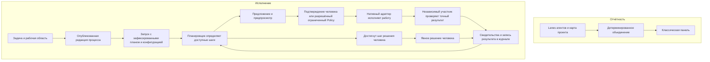

# Архитектура December Command

[English version](architecture.md) · [Первый запуск](first-run-v1.md) · [Участие в разработке](../CONTRIBUTING.ru.md)

December Command работает локально на Python 3.11+ без зависимостей времени выполнения. Интерфейс написан на обычных JavaScript, HTML и CSS и не требует сборки. Studio открывается по адресу `/` и содержит пять экранов: обзор, процесс, запуски, решения и агенты. Классическая панель отчётности доступна по адресу `/panel/index.html`.

Сервер на Python отвечает за проверку данных, хранение и разрешение исполнения. Браузер показывает эти факты и отправляет явные запросы; появление кнопки или открытие страницы не разрешает работу модели. Исполнение идёт через настроенные адаптеры нативных harness'ов Claude Code, Codex, Kimi Code, Grok Build и DSH. Каждому нужны поддерживаемая конфигурация и доступ; наличие в списке ещё не означает готовность на этой машине.

## Два связанных представления, два источника истины

**Отчётные lanes** описывают происходящее со слов агентов. Каждый агент пишет собственный JSON-файл lane. Детерминированное объединение lanes и карты проекта вычисляет разногласия, устаревшие отчёты и вопросы человеку. Lanes не разрешают исполнение и не заменяют журнал запуска Studio. Их формат определён в [Protocol v1](../spec/PROTOCOL.md).

**Исполняемые процессы** описывают разрешённую работу. Studio публикует редакцию workflow и создаёт из неё запуск. План и конфигурация запуска остаются неизменными; предложения, разрешения, решения, свидетельства проверки и результаты добавляются в журнал. Текущее состояние вычисляется из этой истории. Новая редакция процесса не меняет уже созданный запуск.

Планировщик вычисляет допустимость шагов, а не запускает процессы сам. Драйвер Policy может продвигать доступные шаги только при действующем разрешении с рассмотренными человеком условиями.

## Путь одной задачи

1. **Создайте задачу.** У неё есть идентификатор, название и постоянный `work_scope`. Одна задача может включать несколько запусков; связь с задачей входит в зафиксированную конфигурацию каждого запуска.
2. **Опубликуйте процесс и создайте запуск.** Черновик можно менять. Публикация создаёт новую неизменяемую редакцию. Создание запуска фиксирует выбранный план, участников и конфигурацию, но не запускает harness.
3. **Создайте предложение и изучите его.** Предложение указывает шаг, участника, действие, входные материалы, область работы и лимиты. У предпросмотра есть digest — отпечаток содержимого для обнаружения изменённых условий. Само предложение не даёт права исполнять работу.
4. **Разрешите исполнение.** Режим Confirm требует свежего подтверждения человеком одного неизменённого предпросмотра. Явно включённый ограниченный запуск Policy требует отдельного предпросмотра и разрешения его плана, материалов, участников и бюджетов.
5. **Исполните и проверьте.** Среда исполнения записывает разрешение до обращения к адаптеру. Отдельный проверяющий получает точный результат исполнителя и относящиеся к нему входные материалы. Тип harness может совпадать, но участник должен быть другим. Завершение процесса само по себе не означает проверенный успех.
6. **Запишите результат и продолжайте.** Свидетельства и запись результата объясняют наблюдавшийся исход. По журналу планировщик определяет следующий допустимый шаг или ожидающее решение человека. Одобрение человека и проверка результата остаются разными фактами.

Режимы управления: `observe` — чтение; `propose` — запись предложений; `confirm` — разрешение отдельных действий; `policy` — продвижение в явных пределах. Текущий ограниченный Policy задаёт число действий, длительность действия, суммарное время работы и число исполнений узлов; одновременно разрешено одно действие. Ответ модели не может расширить полномочия.

Шаги решения человека всегда требуют человека. Пауза и отзыв прекращают выдачу дальнейших разрешений. Перезапуск сервера восстанавливает историю, но не активирует прежний grant Policy: возобновление требует явного разрешённого действия. Если после прерывания эффект действия неизвестен, состояние остаётся `unknown`; восстановление не угадывает успех и не повторяет эффект.

## Отклонение допускает исправление, неопределённость — нет

В явно включённом ограниченном Policy проверяющий может вернуть `VERDICT: reject` и типизированные замечания по протоколу `conduct.feedback.v1`. Замечание имеет тип `defect`, `missing_requirement` или `verification_gap`, описание и необязательное место в файле. Среда исполнения связывает его с реальным проверяющим, действием и результатом; модель не назначает эти полномочия.

Корректные замечания могут попасть в предложение исправления через явный переход `on_failed` или разрешённый цикл. Предложение фиксирует идентификаторы замечаний. Для исправления по-прежнему нужны действующий grant, доступный шаг и оставшийся бюджет; замечания не меняют область работы, инструменты, участников или лимиты.

Отклонение с повреждёнными или недопустимыми замечаниями остаётся отклонением (`rejected_findings_refused`), но не даёт данных для автоматического исправления. Отсутствие вердикта, неизвестный исход исполнения и замечания без окончательной записи отклонения проверяющим тоже останавливают автоматическое исправление. Старые запуски Confirm сохраняют прежние правила вердиктов. Подробнее: [интеграция ограниченного исполнения и обратной связи](specs/2026-09-21-bounded-feedback-integration.md).

## Где лежат данные и как разделяются задачи

До явной активации владения проектом данные находятся в `conductor/`. Активация переносит действующие данные в `conductor.v3/`, а `.conduct/` хранит записи владения. Код определяет каталог через `ownership.data_root()`. Владение проектом разрешает согласованную запись данных, а не автоматическое исполнение.

| Путь относительно активного каталога данных | Назначение |
| --- | --- |
| `map.toml`, `lanes/<author>.json`, `events.jsonl` | Входные данные классической отчётности; у каждой lane один автор записи |
| `tasks/<task_id>/task.json` | Постоянные идентификатор задачи и рабочая область |
| `templates/<workflow_id>/` | Изменяемый черновик и неизменяемые опубликованные редакции |
| `runs/<run_id>/` | Зафиксированные файлы запуска и дополняемый журнал `records.jsonl` |
| `providers.json` | Настройки адаптеров и ссылки на учётные данные, без значений секретов |

Относительно корня рабочей среды harness файлы задачи расположены в `work/_tasks/<work_scope>/<work_item_id>/`. Две задачи могут использовать одинаковое имя рабочего элемента, не разделяя этот каталог. Запуски одной задачи используют её рабочую область; новый запуск сам по себе не создаёт новую файловую песочницу. Старые запуски без задачи сохраняют путь `work/<work_item_id>/`.

Рабочая среда проверяет границы путей и область чтения и изменения результатов. Эти проверки не являются универсальной песочницей операционной системы. Различайте контролируемую рабочую копию, независимо проверенный результат и явное принятие этого результата пользователем в свой репозиторий.

## Короткая карта для разработчика

Пути ниже указаны от корня репозитория. Начните со строки, которая отвечает за нужное поведение.

| Что менять | Что читать сначала |
| --- | --- |
| Команды CLI, локальный сервер и HTTP-маршруты | [`__main__.py`](../src/conductor/__main__.py), [`server.py`](../src/conductor/server.py), [`server_command.py`](../src/conductor/server_command.py) |
| Формат lanes и вычисляемое состояние отчётности | [`schema.py`](../src/conductor/schema.py), [`store.py`](../src/conductor/store.py), [`merge.py`](../src/conductor/merge.py) |
| Задачи, черновики процессов и неизменяемые редакции | [`command/task_contracts.py`](../src/conductor/command/task_contracts.py), [`task_store.py`](../src/conductor/command/task_store.py), [`workflow_draft.py`](../src/conductor/command/workflow_draft.py), [`template_store.py`](../src/conductor/command/template_store.py) |
| Правила плана и допустимость следующего шага | [`command/graph_definition.py`](../src/conductor/command/graph_definition.py), [`graph_schedule.py`](../src/conductor/command/graph_schedule.py) |
| Разрешение действий, исполнение и история | [`command/runtime.py`](../src/conductor/command/runtime.py), [`run_store.py`](../src/conductor/command/run_store.py), [`policy_service.py`](../src/conductor/command/policy_service.py), [`policy_driver.py`](../src/conductor/command/policy_driver.py) |
| Интеграция harness и объявленные действия | [`command/providers.py`](../src/conductor/command/providers.py), [`adapters/provider.py`](../src/conductor/command/adapters/provider.py), [`adapters/base.py`](../src/conductor/command/adapters/base.py), транспорт провайдера в [`adapters/`](../src/conductor/command/adapters/) |
| Независимая проверка и данные для исправления | [`command/verify_road.py`](../src/conductor/command/verify_road.py), [`adapters/independent_check.py`](../src/conductor/command/adapters/independent_check.py), [`adapters/feedback_protocol.py`](../src/conductor/command/adapters/feedback_protocol.py), [`feedback_runtime.py`](../src/conductor/command/feedback_runtime.py) |
| Каталоги задач и границы путей | [`command/work_layout.py`](../src/conductor/command/work_layout.py), [`adapters/harness_workspace.py`](../src/conductor/command/adapters/harness_workspace.py) |
| Представление Studio и действия в интерфейсе | [`panel/studio.js`](../src/conductor/panel/studio.js), [`studio-shell.js`](../src/conductor/panel/studio-shell.js), [`studio-store.js`](../src/conductor/panel/studio-store.js), соответствующие модули `studio-*.js` |

Новое действие сначала описывается в контрактах возможностей и аргументов адаптера, затем появляется в Studio. Реестр провайдеров связывает объявленные возможности с реальными реализациями. Доступность интерфейса выводите из этих объявлений, а не из условий по названию провайдера. Особый синтаксис команды оставляйте в её адаптере, правила разрешения и журнала — в ядре.

## Восемь слов, которые встретятся в коде

| Термин | Значение здесь |
| --- | --- |
| **Harness** | Внешняя программа для работы модели и инструментов, например Codex или Claude Code. |
| **Participant / instance — участник** | Один настроенный исполнитель или проверяющий в плане. Его роль не зависит от бренда harness. |
| **Adapter — адаптер** | Интеграция на Python: объявляет поддерживаемые действия, реализует подготовку, исполнение, наблюдение и проверку. |
| **Workflow — процесс** | Повторно используемый план шагов, переходов, решений человека и ограниченных циклов; публикация фиксирует редакцию. |
| **Run — запуск** | Одна история исполнения с зафиксированными процессом и конфигурацией. Журнал растёт, исходный план не меняется. |
| **Proposal / preview — предложение / предпросмотр** | Предлагаемое действие и точные условия, которые человек изучает перед разрешением. |
| **Grant — разрешение** | Явное ограниченное право исполнять работу. Сохранённое разрешение Policy всё ещё требует активации и проверок допуска. |
| **Receipt — запись результата или решения** | Постоянная запись о наблюдавшемся исходе или решении. Ссылки на evidence ведут к подтверждающим наблюдениям; одного текста исполнителя для доказательства мало. |

## V1 и будущая работа

Описанные механизмы реализованы в текущем кандидате V1; этот документ не объявляет приёмку релиза и не подтверждает каждую локальную настройку провайдера. Некоторые старые ADR называют командный слой «V2»; эта историческая метка не является таблицей готовности функций сегодня.

Исполнение через Qwen, улучшение стратегии по мотивам Dream-RSI и эксперименты с передачей контекста по мотивам SoL-Pi относятся к будущему направлению V2 вместе с журналом опыта и графом harness'ов, взвешенным по свидетельствам. Запись о бренде не является исполняемым адаптером. Каждое изменение стратегии остаётся предложением, которое подтверждает человек. Эти идеи не означают наличие в V1 механизма памяти или автоматического переключения моделей. См. [границы V1/V2](v1-v2-scope.md) и [примечания к релизу](release-notes-v1-alpha.ru.md).

Обоснования границ описаны в ADR [0002: идентичность запуска](adr/0002-command-run-identity-and-store.md), [0003: протокол адаптера](adr/0003-command-action-and-adapter-protocol.md), [0005: свидетельства](adr/0005-command-evidence-verification.md) и [0006: режимы управления](adr/0006-command-control-modes-and-policy-effects.md). Читайте их вместе с актуальными модулями, ссылки на которые приведены выше.
